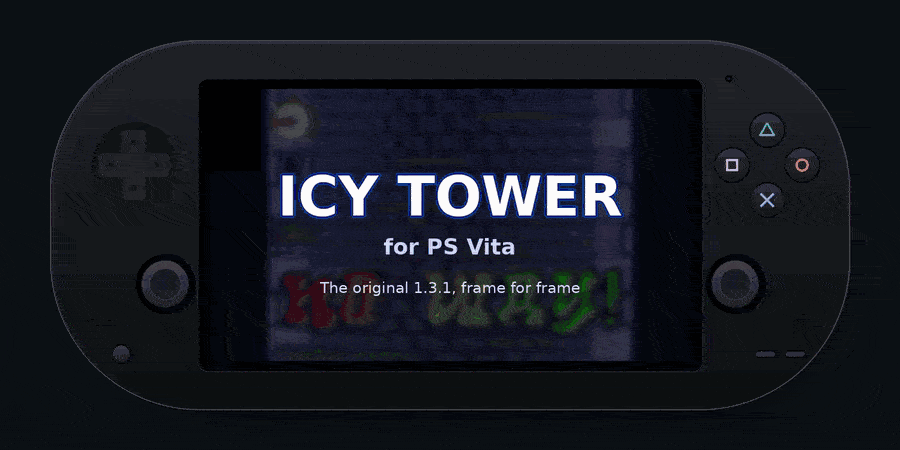
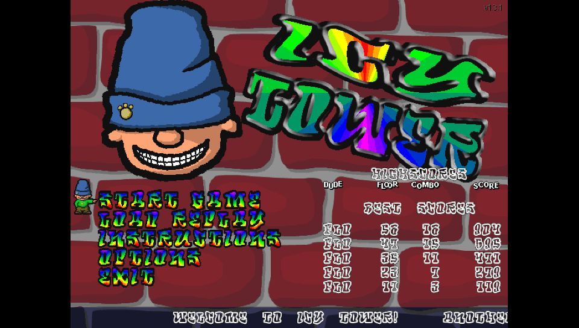
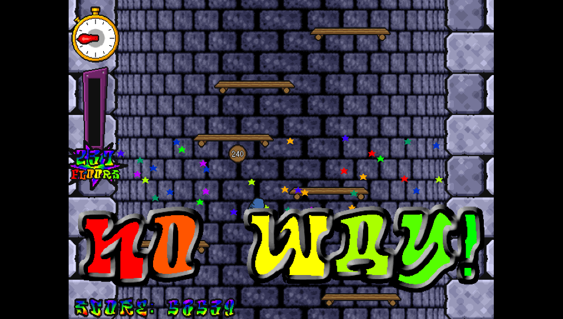
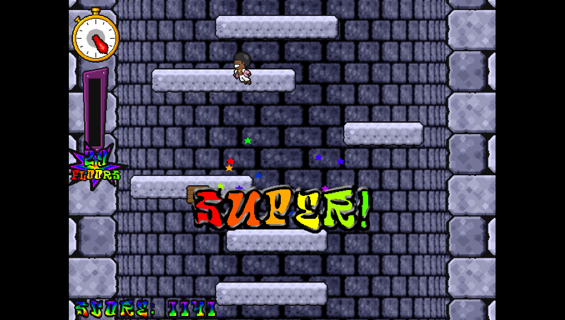
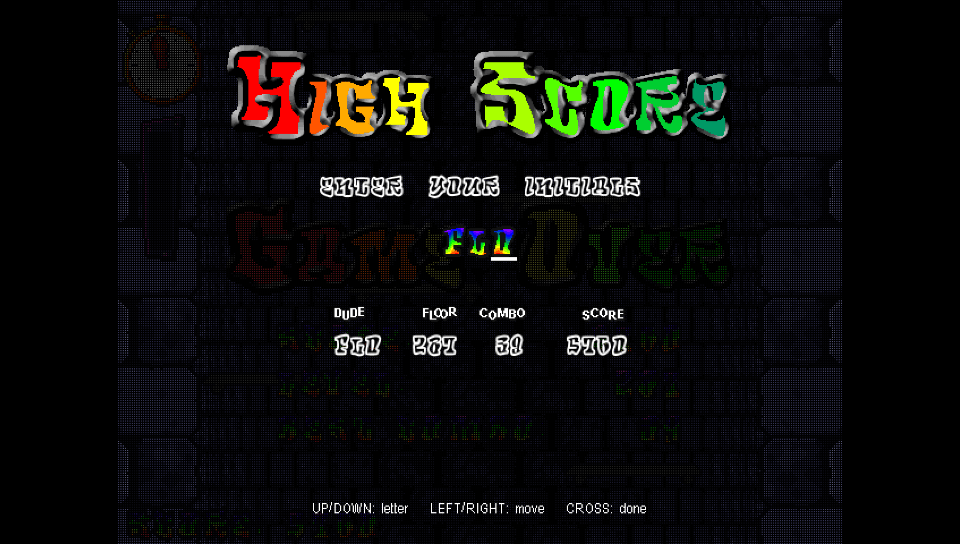
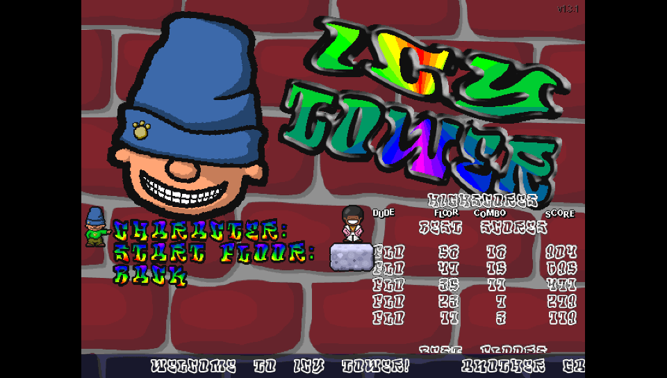
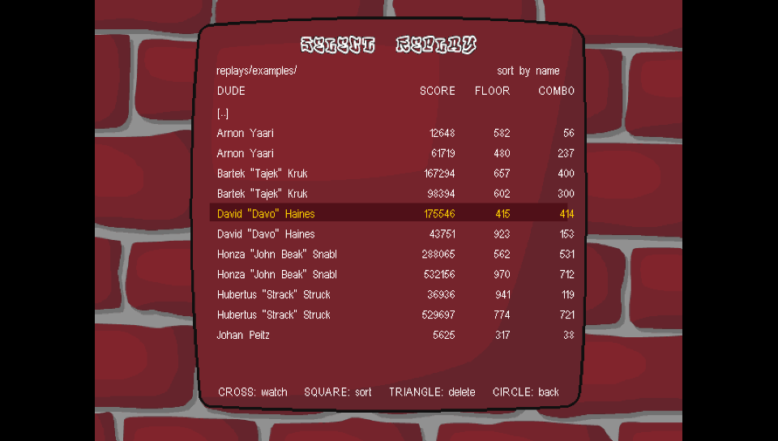

<div align="center">

# Icy Tower for PS Vita

**The original Icy Tower 1.3.1, frame for frame, on your PS Vita.**

A from-scratch engine port that plays with the game's own graphics, sounds and music, read from your copy of the free PC game.

Made by **İbrahim Doğan**

[**⬇ Download the latest VPK**](https://github.com/ibrahim-dogan/vita-icy-tower/releases/latest)



<sub>[Watch the trailer in full quality (MP4)](docs/media/trailer.mp4)</sub>

</div>

## Screenshots

| Title screen | Combo reward |
| :---: | :---: |
|  |  |
| **Custom characters (Disco Dave)** | **Highscore** |
|  |  |
| **Game options** | **Replay browser** |
|  |  |

<sub>Captured from the desktop build, which runs the same code and shows the Vita's 960×544 picture (Sharp screen mode). The gameplay shots are the example replays that come with the PC game.</sub>

## Installation

You need a PS Vita (or PS TV) running HENkaku / Ensō and [VitaShell](https://github.com/TheOfficialFloW/VitaShell).
You also need a PC (Windows, macOS or Linux) once, to get the game files.

The VPK contains **none of Icy Tower's graphics, sounds or music**. They belong to Free Lunch
Design, so the port reads them from your own copy of the free PC game.

1. Download **`icytower.vpk`** from the [latest release](https://github.com/ibrahim-dogan/vita-icy-tower/releases/latest), copy it to the Vita and install it with VitaShell.
2. Get **Icy Tower 1.3.1**, which is freeware. The original installer `icytower13_install.exe` is on
   [archive.org](https://archive.org/details/Icy_Tower) (SHA-1 `a00aa6ebc4c37fac7c44de91671477ef7e32389a`).
3. Get the game files out of it:
   - **Windows:** run the installer, then open the installed folder (usually `C:\Program Files\Icy Tower 1.3`).
   - **macOS / Linux:** run `tools/prepare_data.sh icytower13_install.exe` from this repository. It uses
     [innoextract](https://constexpr.org/innoextract/), or Docker if innoextract is not installed. The files
     end up in a folder named `icytower/`.
4. Copy `data/`, `characters/` and (optionally) `replays/` to **`ux0:data/icytower/`** on the Vita, for example
   with VitaShell's FTP or USB mode.
5. Start **Icy Tower** from the LiveArea.

The folder must look like this:

```
ux0:data/icytower/
├── data/
│   ├── data.dat           graphics and fonts
│   └── sfx13.dat          sounds and music
├── characters/
│   ├── harold_the_homeboy/
│   │   ├── harold_the_homeboy.txt
│   │   └── harold.dat
│   ├── disco_dave/
│   └── template/
├── replays/               optional: the example replays, and where yours are saved
└── sfx/                   optional: your own sounds (good.wav, bg_beat.wav …)
```

The game creates `icytower_vita.cfg` (options, unlocked floors, highscores) and `log.txt` there.

**Gotchas**

- The files must come from **version 1.3.1**. The files of other versions (1.4, 1.5 …) have not been tested.
- Copy the files directly into `ux0:data/icytower/`, and not into a subfolder like
  `ux0:data/icytower/Icy Tower 1.3/`. `ux0:data/icytower/data/data.dat` must exist.
- Copy the whole `characters/` folder. At least one character (normally Harold) is required.
- If the files are not found, the game shows a screen that lists what is missing.
- Please don't upload the game files together with the VPK. Everyone should get them from the original release.

## Controls

| In game | |
| --- | --- |
| D-pad / left stick | Run left / right |
| Cross, Square, Triangle | Jump. With ReJump on (the default), hold to keep jumping |
| Start | Pause |
| Circle | Quit to the menu (asks first) |

| Menus | |
| --- | --- |
| D-pad | Move, change a value (left / right) |
| Confirm / Cancel | Select / back. These follow the console's X/O setting |

| Watching a replay | |
| --- | --- |
| Right or R (hold) | Fast forward ×2 |
| Up (hold) | Fast forward ×4 |
| Cross / Start | Pause |
| Circle | Stop |

When you enter initials or a replay name, Up and Down change the letter, Left and Right move
the cursor, Square deletes a letter and Cross accepts.

Hidden: hold **L + R** and press **Select** to show the frame rate.

## Features

- **The 1.3.1 engine, frame for frame.** Physics, scrolling speed, the floor generator, combos
  and score follow the reverse engineered original. The game logic runs at the original 50 Hz,
  and movement is interpolated for the Vita's 60 Hz screen.
- **Replays compatible with the PC game** (`.itr`, ITR130). Watch the last game, save it with your
  name, and browse `replays/`, subfolders included, sorted by name, score, floor or combo. You can
  also delete replays there. Replays saved on the Vita play in the PC game, and PC replays play on
  the Vita.
- Everything from the original game:
  - combos with the ten reward shouts, from GOOD to NO WAY
  - the combo meter, the hurry-up clock and the stars
  - floor signs every 10 floors and the eleven floor types
  - start floors that unlock as you climb
  - Eye Candy None / Some / Lots
- **The three highscore tables** (best scores, floors and combos) with initials entry, shown
  scrolling on the title screen like on the PC.
- **Custom characters in the original 1.3 format.** Drop a character folder into `characters/` and
  pick it in *Options → Game Options*. Both kinds of character work:
  - `[datafile]` characters, like Harold and Disco Dave
  - `[frames]` sheets (8-bit BMP or PCX) with WAV/OGG sounds, like `template/`

  As on the PC, the character's palette becomes the game's palette.
- **Custom game sounds:** put `sfx/<name>.wav` files next to `data/`. The names are the ones the PC
  game uses, e.g. `good.wav`, `bg_beat.wav`, `bg_meny.wav`.
- **Screen modes** (*Options → GFX Options → Screen*):
  - **Sharp:** crisp pixels, scaled to the full height. This is the default.
  - **Smooth:** filtered.
  - **Wide:** stretched to 16:9.
  - **1:1:** the original 640×480, unscaled.
- Sound and music volume, and the ReJump setting.

## Compatibility and troubleshooting

- This is the first release. It was developed and tested mostly with the desktop build, and the
  Vita build has had only a little testing on real hardware so far. Please report anything that
  looks or plays differently from the PC version.
- **Missing files screen:** check the folder tree above. In particular, `ux0:data/icytower/data/data.dat`
  must exist.
- **A character is missing from the list:** its folder name and its `.txt` file must match
  (`jolly_joe/jolly_joe.txt`), and it needs all 15 frames. The log says why a character was skipped.
- **The picture looks wrong:** try another screen mode under *Options → GFX Options → Screen*.
- 4 of the 15 example replays of the PC game do not reach their recorded score. The reverse
  engineered reference checker gives the same result for those 4, so they were most likely recorded
  with a beta build. The other 11 match exactly.
- Not implemented: key rebinding (the Vita uses the fixed layout above) and the "fun mode" easter egg.
  The PC's *Fullscreen* option became *Screen*.

**Log file:** `ux0:data/icytower/log.txt`. It is rewritten on every start and lists the loaded data,
characters and custom sounds, and any errors. Please attach it when you
[open an issue](https://github.com/ibrahim-dogan/vita-icy-tower/issues).

## Building from source

Everything builds in Docker:

```sh
./build.sh           # dist/icytower.vpk (VitaSDK image)
./build.sh test      # replay compatibility test + scripted headless screenshots
./build.sh media     # the screenshots and trailer in docs/media
```

`test` and `media` need the original game files in `./gamedata`
(`tools/prepare_data.sh icytower13_install.exe gamedata`). The desktop build is the same game with SDL2.
Only the desktop build contains the scripting, recording and autoplay hooks for these tools.

| Path | What it is |
| --- | --- |
| `src/core.c` | The deterministic 1.3.1 engine (physics, floors, combos, score) |
| `src/replay.c` | ITR130 replay load, save, record and validate |
| `src/game.c` | Gameplay scene: effects, sounds, drawing, replay playback |
| `src/menu.c`, `src/screens.c` | Title screen, options, highscores, replay menus and browser |
| `src/datafile.c` | Allegro 4 datafile reader (encryption, LZSS) |
| `src/res.c` | Loading data, characters and custom sounds from `ux0:data/icytower` |
| `src/gfx.c`, `src/font.c` | 8-bit software renderer and Allegro fonts |
| `src/video.c` | Vita: vita2d with a paletted texture. Desktop: SDL2 |
| `src/audio.c` | Mixer with OGG/WAV decoding |
| `tests/`, `tools/shots/` | Replay test and scripted screenshot runs |
| `tools/` | Data preparation, media pipeline, LiveArea images, Vita frame |
| `docs/NOTES.md` | Reverse engineering notes |

## Credits

- **İbrahim Doğan**: the PS Vita port.
- **Icy Tower** by Johan Peitz / [Free Lunch Design](https://www.freelunchdesign.com). Music and sound effects by Anders Svensson.
- RaMMicHaeL (Ramen Software): the reverse engineered 1.3.1 engine in
  [replay_checker](https://ramensoftware.com/revealing-the-secrets-of-icy-tower-v1-3-1), which `src/core.c` follows.
- [icytower-ng](https://github.com/royeldar/icytower-ng) by royeldar (MIT). The presentation logic follows its
  reconstruction of 1.3.1: animations, eye candy, the effects random generator and the tower wall generator.
- [Allegro 4](https://liballeg.org). Its datafile, LZSS and light table algorithms are re-implemented here (giftware license).
- [stb_vorbis](https://github.com/nothings/stb) and stb_image_write (public domain),
  [font8x8](https://github.com/dhepper/font8x8) (public domain),
  [SDL2](https://www.libsdl.org), [vita2d](https://github.com/xerpi/libvita2d), [VitaSDK](https://vitasdk.org).
- [DejaVu fonts](https://dejavu-fonts.github.io), used in the LiveArea images and the trailer cards.

See [THIRD_PARTY.md](THIRD_PARTY.md) for the licenses. This port's source code is MIT licensed ([LICENSE](LICENSE)).

Icy Tower, its characters, graphics, sounds and music belong to Free Lunch Design, and the game content
shown in the screenshots and trailer belongs to its authors. This project is not affiliated with Free Lunch Design.
PlayStation and PS Vita are trademarks of Sony Interactive Entertainment. This project is not affiliated with Sony.
